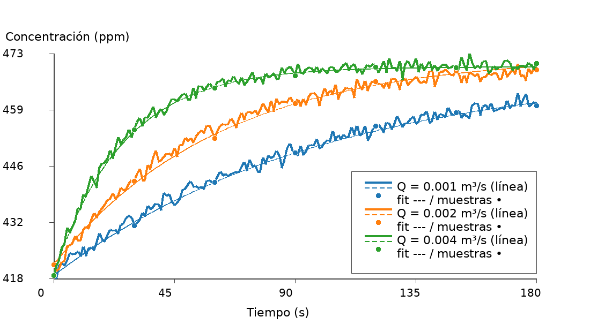

# Impacto del caudal sobre la respuesta OFC

## Contexto
- Cámara cúbica (100 L) con `Ac = Ain = 0.01 m²` y salida reducida (`Aout = 1.27×10⁻⁴ m²`).
- Ruido de medición reducido a `noise_ppm_std = 1 ppm`, acorde a la deriva típica de sensores NDIR.
- Escenarios evaluados durante 180 s con muestreo sintético cada 30 s (`*_samples_30s.csv`).
- Caudales impuestos mediante el modo `area_velocity` (`area = 0.01 m²`):
  - **Bajo:** `v = 0.1 m/s` → `Q = 0.001 m³/s`.
  - **Medio:** `v = 0.2 m/s` → `Q = 0.002 m³/s`.
  - **Alto:** `v = 0.4 m/s` → `Q = 0.004 m³/s`.

## Resultados
| Escenario | Caudal (m³/s) | θ = Vc/Q (s) | C(180 s) [ppm] | t₉₅ (s)* |
| --- | ---: | ---: | ---: | --- |
| Bajo (`flow_low`) | 0.001 | 100 | 460.67 | — (no alcanza 95 %) |
| Medio (`flow_mid`) | 0.002 | 50 | 467.57 | 139 |
| Alto (`flow_high`) | 0.004 | 25 | 468.90 | 72 |

\* t₉₅ corresponde al instante en que la serie supera el 95 % del salto (`420 → 470 ppm`).

- Archivos generados: `data/processed/simulation_flow_<escenario>.csv` y sus gráficos (`.png`) + muestreos (`_samples_30s.csv`).
- Ejemplo visual (escenario alto):

### Estimación de flujo desde el muestreo (30 s)

| Escenario | Flujo real (mg·m⁻²·h⁻¹)** | Flujo estimado | Error % |
| --- | ---: | ---: | ---: |
| Bajo (`flow_low`) | 5.00 | 4.90 | −1.9 % |
| Medio (`flow_mid`) | 10.00 | 9.95 | −0.5 % |
| Alto (`flow_high`) | 20.00 | 20.05 | +0.3 % |

**Flujo real calculado con `Q*(C_G - C_A)/A_c`, donde `C_G = 470 ppm`, `C_A = 420 ppm` y `A_c = 0.01 m²`.

Los valores estimados provienen de `fit_flow_<escenario>.json`, generados corriendo `scripts/fit_from_csv.py` sobre las series muestreadas cada 30 s (`simulation_flow_<escenario>_samples_30s.csv`).

## Análisis
1. **Tiempo característico (θ):** al duplicar el caudal, θ se reduce a la mitad, acelerando la convergencia hacia `C_G`. El caso bajo (θ = 100 s) no alcanza 95 % del objetivo en 180 s.
2. **Concentración final:** los caudales mayores se aproximan más a `C_G = 470 ppm` dentro de la ventana simulada; la diferencia entre medio y alto es ~1.3 ppm al final del periodo.
3. **Ruido y muestreo:** con 1 ppm de desvío, las curvas conservan suavidad y las muestras cada 30 s permiten distinguir la señal analítica de las observaciones discretas; el ajuste recupera el flujo con ±2 % de error.
4. **Implicaciones operativas:** para campañas de 3 minutos, un caudal ≥ 0.002 m³/s garantiza más del 95 % del salto esperado y una estimación estable del flujo superficial.

## Próximos pasos
- Repetir el análisis incluyendo el ajuste exponencial (`scripts/fit_from_csv.py`) para cuantificar cómo cambia el flujo estimado con cada caudal.
- Explorar caudales aún mayores (o combinaciones de `Aout`) para encontrar el balance entre sensibilidad y tiempo de muestreo.
- Incorporar estas curvas en los notebooks para que los usuarios puedan seleccionar el caudal desde sliders y observar su efecto en tiempo real.
