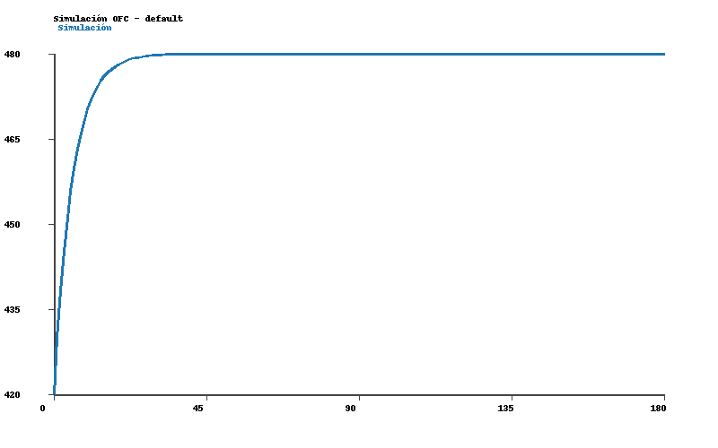

# Informe de simulación y ajuste (notebooks)

## Contexto
- Configuración base: `configs/default.yaml`, ajustada en notebook para `duration_s = 60 s`, `target_cg_ppm = 470`, `scenario = notebook_quickstart`, e incorporando un ruido gaussiano de `5 ppm` en la medición para simular error instrumental.
- Geometría de cámara: `Vc = 0.011 m³` (volumen interno del domo). La huella superficial coincide con la sección de entrada: `Ac = Ain = 5×10⁻⁴ m²`, lo que modela una cámara apoyada directamente sobre el agua captando todo el flujo ascendente. El gas se libera por el orificio de salida `Aout = 5×10⁻⁴ m²`.
- Condiciones ambientales: `T = 298 K`, `P = 101325 Pa`, `C_A = 420 ppm`.
- Inflow: serie `data/raw/qg_series.csv` (`mode = timeseries`).
- Datos de ajuste: `data/raw/demo_CO2.csv`.
- Entorno notebook ejecutado desde `notebooks/` con rutas absolutas (`ROOT = ..`).

## Resultados de simulación
- Estado inicial: `C0 = 420 ppm`, objetivo `C_G = 470 ppm`.
- Caudal medio estimado: ~0.0020 m³/s.
- Artefactos:
  - CSV: `data/processed/simulation_notebook_quickstart.csv`
  - PNG: `data/processed/simulation_notebook_quickstart.png`
- Observación: la serie alcanza ~468 ppm a los 60 s, reproduciendo el enfoque del script CLI.

## Resultados de ajuste
- Ajuste sobre `demo_CO2.csv` usando `run_fit_workflow` con bootstrap (`n_bootstrap=200`).
- Artefactos: JSON/PNG en `data/processed/demo_CO2_notebook_fit.*`.

- Glosario rápido:
  - `C0`: concentración inicial en cámara (ppm).
  - `C_G`: concentración de equilibrio del gas dentro de la cámara (ppm).
  - `θ` (`theta_s`): tiempo característico `Vc / Qg` (s), describe qué tan rápido responde la cámara.
  - `flux_mg_m2_h`: flujo superficial resultante (mg·m⁻²·h⁻¹) según geometría.
  - `rmse`, `r2`, `nt`: métricas de ajuste (error cuadrático medio, coeficiente de determinación, y número de trazas efectivas).
  - Sufijo `_ci`: intervalo de confianza 95 % proveniente del bootstrap.

| Métrica | Valor | IC 95 % |
| --- | ---: | ---: |
| `c0_ppm` | 420.00 | — |
| `cg_ppm` | 610.25 | [545.93, 1 208 630.51] |
| `theta_s` (s) | 9.05 | [5.60, 98 215.39] |
| `flux_mg_m2_h` | 3.26 | [0.15, 3.68] |
| `rmse_ppm` | 2.29 | — |
| `r2` | 0.993 | — |
| `nt` | 12.49 | — |

- Interpretación: el ajuste estima un `C_G` mayor que la simulación (610 ppm) y un `θ` moderado (~9 s). El flujo superficial resultante es 3.26 mg·m⁻²·h⁻¹ con un intervalo amplio producto del bootstrap (indicando alta incertidumbre en las mediciones).

## Observaciones
- Las rutas absolutas (`ROOT / ...`) garantizan que notebooks y scripts compartan carpetas.
- `save_simulation` no generó Parquet porque no hay motor (`pyarrow`/`fastparquet`) instalado, pero sí crea CSV/PNG.
- Los gráficos generados son equivalentes a los de los scripts, confirmando consistencia.

## Próximos pasos
1. Repetir el ajuste con `use_bootstrap: true` en `configs/default.yaml` para poblar los intervalos de confianza en el JSON.
2. Ejecutar `nbconvert` con `export PYTHONPATH=$PWD/src` para producir versiones `_executed` de los notebooks.
3. Instalar `pyarrow` si se desea almacenar también `.parquet` desde notebooks y scripts.
