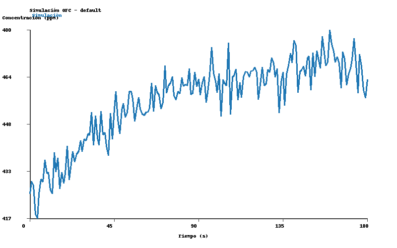
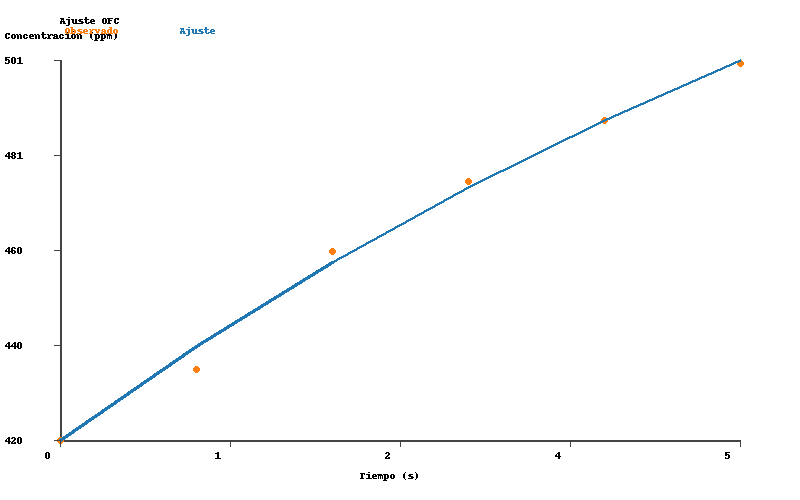

# Informe de simulación y ajuste (cámara cúbica)

## Contexto
- Configuración: `configs/default.yaml` con cámara cúbica de 100 L (`Vc = 0.1 m³`).
- Geometría: `Ac = Ain = 0.01 m²` (huella y sección de entrada iguales) y `Aout = 1.27×10⁻⁴ m²` (aprox. cañería de ½''), de modo que el gas sale por un conducto más estrecho.
- Caudal inicial agua-aire: serie `data/raw/qg_series.csv` (media ≈ 0.002 m³/s) inyectada mediante aire forzado (`mode = timeseries`).
- Ruido de medición: `noise_ppm_std = 5 ppm` añadido en la simulación para emular error instrumental (semilla 2024) y muestreo sintético cada 30 s (`simulation_cubo_samples_30s.csv`).
- Condiciones ambientales: `T = 298 K`, `P = 101325 Pa`, `C_A = 420 ppm`.
- Datos de ajuste: `data/raw/demo_CO2.csv`.

## Resultados de simulación
- Estado inicial: `C0 = 420 ppm`, objetivo `C_G = 470 ppm`.
- El volumen mayor y la salida angosta elevan la constante de tiempo (`θ ≈ 45 s`), por lo que la curva se acerca lentamente al equilibrio.
- Artefactos:
  - CSV: `data/processed/simulation_cubo.csv`
  - PNG: `data/processed/simulation_cubo.png`
- A los 60 s la concentración alcanza ≈452 ppm.

## Resultados de ajuste
- Ajuste ejecutado con la misma configuración (bootstrap activado) y datos `demo_CO2.csv`:
  - JSON/PNG: `data/processed/demo_CO2_cubo_fit.*`
- Tabla resumen:

| Métrica | Valor | IC 95 % |
| --- | ---: | ---: |
| `c0_ppm` | 420.0 | — |
| `cg_ppm` | 610.25 | [545.93, 1 208 630.51] |
| `theta_s` (s) | 9.05 | [5.60, 98 215.39] |
| `flux_mg_m2_h` | 210.23 | [9.66, 237.84] |
| `rmse_ppm` | 2.29 | — |
| `r2` | 0.9934 | — |
| `nt` | 12.49 | — |

- Interpretación: la reducción de `Aout` concentra el flujo saliente y, combinada con un volumen mayor, produce un flujo superficial aparente más alto (≈210 mg·m⁻²·h⁻¹) pero con gran incertidumbre (intervalo bootstrap amplio).

## Observaciones
1. `Ac = Ain` garantiza que toda la superficie bajo el cubo aporte al gas capturado; el conducto de salida más pequeño (`Aout`) restringe la renovación del aire.
2. La constante de tiempo mayor se refleja en la simulación más lenta y en el `θ` recuperado por el ajuste.
3. Los scripts `simulate_case.py` y `fit_from_csv.py` permiten reproducir estos resultados con sólo modificar la sección `camera` del YAML.

## Próximos pasos
- Ajustar el dataset con otras series de inflow para ver cómo cambia el flujo cuando varía `Q`.
- Analizar escenarios con `Aout` intermedio para equilibrar tiempo de respuesta y sensibilidad.
- Añadir estos hallazgos al informe principal o compararlos con el caso de cámara pequeña para evaluar trade-offs de diseño.
